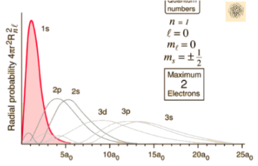
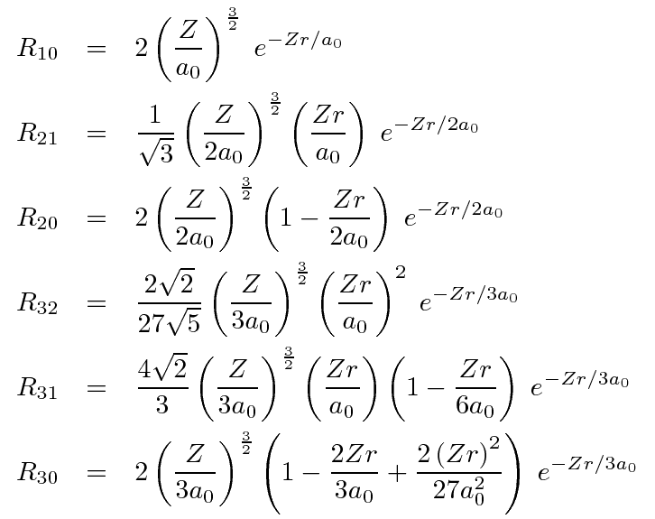

---
tags:
  - quantum
title: Orbitals
---
[Wave Function](Wave%20Function.md)

## Quantum Numbers
$$n$$
Principal quantum number
- 1, 2, 3...
- ***Electron shell***, electron energy and size of orbital
$$l$$
Orbital Angualar Momentum Number
- $0-(n-1)$
- ***Shape*** of the orbital
	- 0 = s
	- 1 = p
	- 2 = d
$$m$$
Z-component / Magentic of $l$
- $-l$ to $+l$
- ***Orientation*** of orbital

## Filling

1.  Aufbau
	-  Start lowest in energy
2.  Pauli's Exclusion
	-  Max two electrons per orbital
	-  No two electrons can have same n, l, m, s tuple
3.  Hund's Rule of Maximum Multiplicity
	-  Orbitals with same energy filled one at a time
	-  Degenerate

## Radial

- Z = Atomic number
- Bohr radius
	- $a_0=\frac \hbar {\alpha mc}$
- Normalisation
	- $\int_0^\infty r^2R_{nl}^*R_{nl}dr=1$

