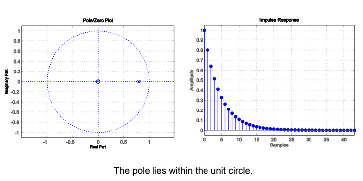
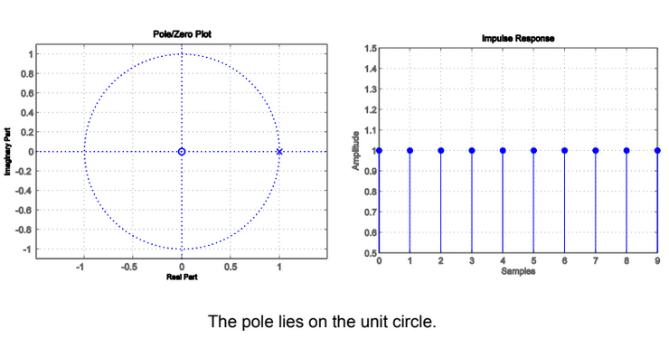
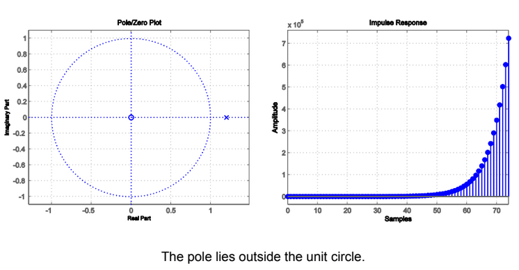
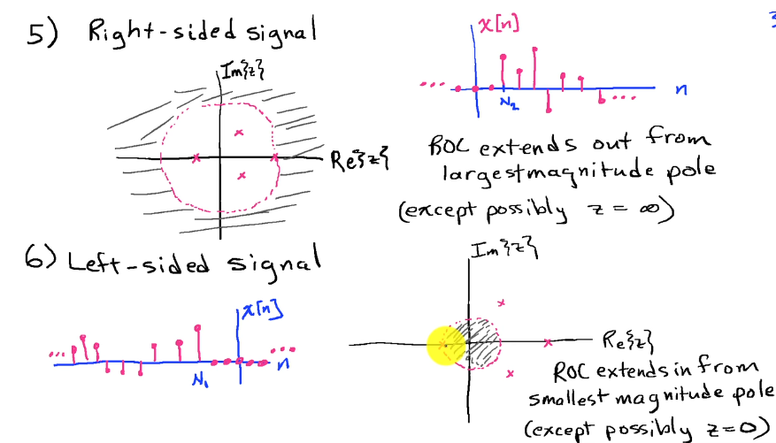
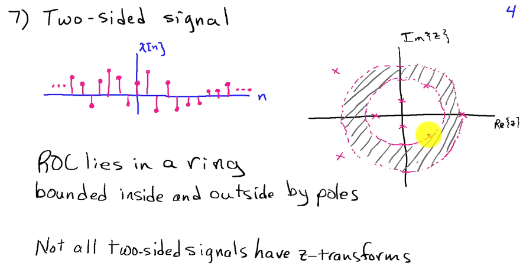

---
tags:
  - maths/signals
---
- Poles
	- **X**
	- Let $X(z) = inf$
		- Let $1/X(z) = 0$
	- Roots of denominator
- Zeros
	- **O**
	- Let $X(z) = 0$
	- Roots of numerator
- In complex (Z for speech) domain

[Magnitude Response From Pole/Zeros](https://www.youtube.com/watch?v=8jNjVkoZQCU)
[MIT Pole Zero](https://web.mit.edu/2.14/www/Handouts/PoleZero.pdf)

Representation of rational [transfer function](Transfer%20Function.md), identifies
- Stability
- Causal/Anti-causal system
- ROC
- Minimum phase/Non minimum phase

# BIBO Stable
- All poles of H must lie within the unit circle of the plot
- If we give an input less than a constant
- Will get an output less than some constant

# Region of Convergence
- Depends on whether causal or anti-causal
- Cannot contain poles
	- Goes to infinity

## Continuous
1. If includes imaginary axis
	- BIBO stable
	- All poles must be left of i axis
2. Rightwards from pole with largest real-part (not infinity)
	- Causal
3. Leftward from pole with smallest real-part (not -infinity)
	- Anti-causal

## Discrete
1. If includes unit circle
	- BIBO stable
2. Outward from pole with largest (not infinite) magnitude
	- Right-sided impulse response
	- Causal (if no pole at infinity)
3. Inward from pole with smallest (nonzero) magnitude
	- Anti-causal

Sinusoidal when complex pair
- $e^{-j\omega}$
- Euler's for oscillating
Exponential when on the axis
- Decays, no $i$ in the exponent

