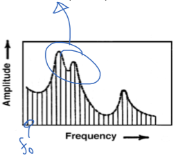

# Phoneme
- Smallest unit of speech
	- Distinguish words
- Continuous speech is stream of different phonemes
- English has 44
- Consonants
	- Voiced or unvoiced
- Vowels
	- All voiced

# Voiced
- Quasi-periodic vibration of vocal cords
- Sound transmitted along vocal tract unimpeded
- Air forced through glottis
	- Quasi-periodic oscillation

# Unvoiced
- Air flow through vocal apparatus is either cut-off or impeded
	- Constriction using tongue or lips
- Turbulence or noise
	- Fricatives
		- \\s\\, \\f\
	- Plosives
		- \\p\\, \\t\
- Modelled as random noise

# Formant
- Vocal tract can be modelled as resonant system
- Modes or peaks in spectral response of resonant system
- Lowest 3 most important in speech
