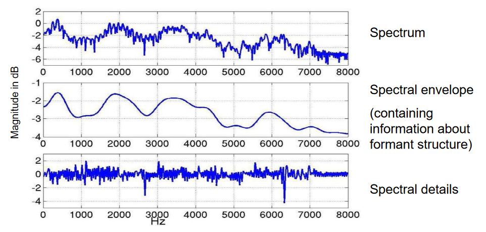

- Input and output signals are real
	- Filter coefficients are real for rational $H(z)$
	- Poles/zeros either real or complex conjugate pairs
- BIBO stability important

# Frequency Response

- Sample along unit circle
	- $|z|=\left|e^{i\omega}\right|=1$

# Magnitude Response
$$\left|H(e^{i\omega})\right|=\frac{b_0|e^{i\omega}-\beta_1|\cdot\cdot\cdot|e^{i\omega}-\beta_q|}{|e^{i\omega}-\alpha_1|\cdot\cdot\cdot|e^{i\omega}-\alpha_p|}$$

- LPC & Cepstral Analysis to separate
- Residual allows more accurate estimation of pitch period